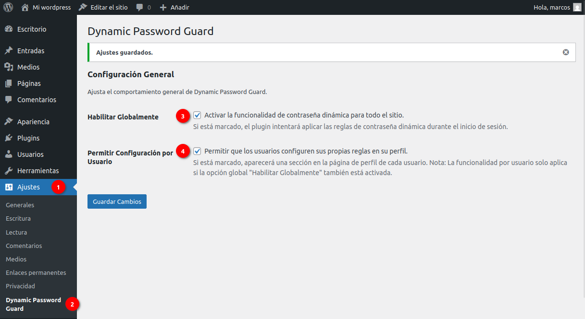
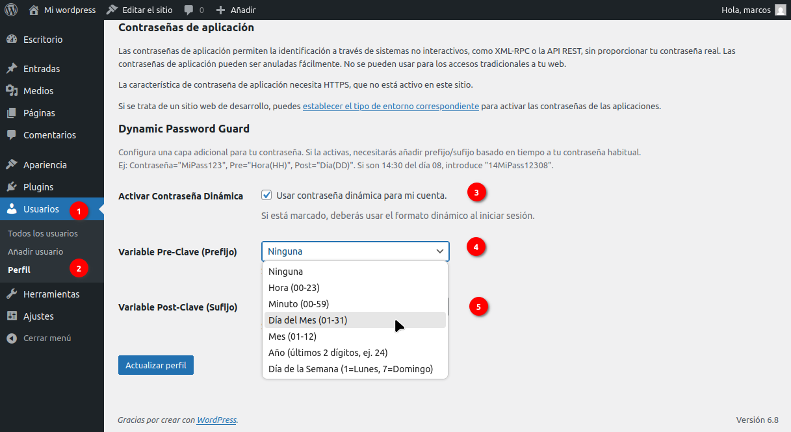
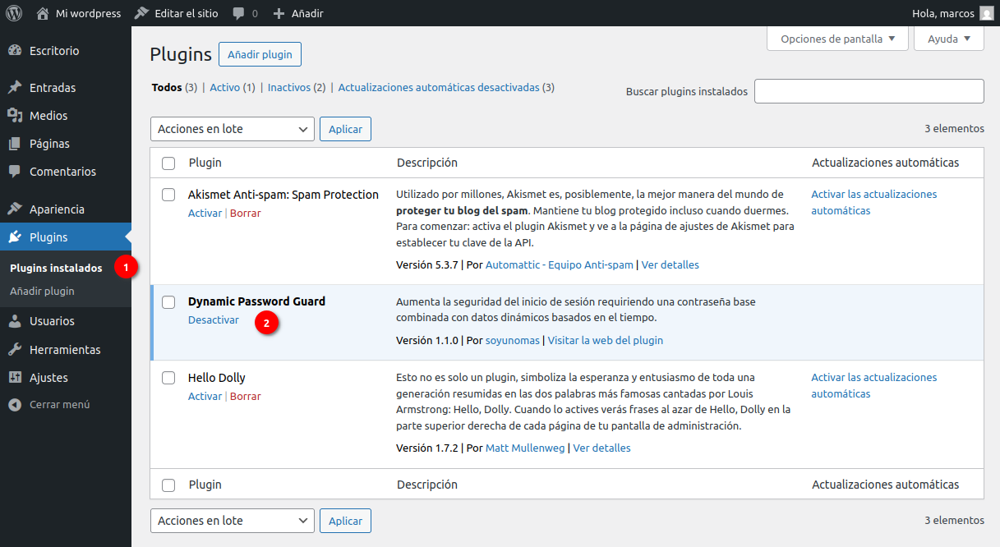

# Dynamic Password Guard

Aumenta la seguridad del inicio de sesión en WordPress requiriendo una contraseña base combinada con datos dinámicos basados en el tiempo, sin alterar la interfaz de usuario estándar.

## Descripción

Dynamic Password Guard (DPG) añade una capa de seguridad significativa a tu sitio WordPress contra ataques de fuerza bruta en el formulario de inicio de sesión. Funciona requiriendo que los usuarios combinen su contraseña habitual (contraseña base) con valores dinámicos basados en la fecha y hora actuales del servidor (según la zona horaria configurada en WordPress).

### Características Principales

*   **Protección Sigilosa (Stealth Mode):** No altera visualmente el formulario de inicio de sesión estándar de WordPress (`wp-login.php`), haciendo que la protección adicional sea invisible para los atacantes. Los mensajes de error son siempre los genéricos de WordPress para no dar ninguna pista.
*   **Contraseña Combinada:** Los usuarios con DPG activado deben introducir `[Valor Pre-Clave][Contraseña Base][Valor Post-Clave]` en el campo de contraseña normal.
*   **Configuración Flexible:**
    *   El Administrador puede habilitar/deshabilitar globalmente el plugin.
    *   El Administrador puede permitir (o no) que los usuarios configuren sus propias reglas.
    *   Los usuarios (si se les permite) pueden activar/desactivar DPG para su cuenta y elegir qué variables de tiempo usar como Pre-Clave y Post-Clave desde su perfil.
*   **Variables de Tiempo:** Selecciona entre Hora (HH), Minuto (MM), Día del Mes (DD), Mes (MM), Año (YY), Día de la Semana Numérico (1-7) o "Ninguna".

### ¿Cómo Funciona?

1.  El plugin intercepta el intento de login antes que WordPress lo procese (usando el filtro `authenticate` con prioridad 10).
2.  Comprueba si el usuario tiene una regla DPG activa.
3.  Si la tiene, calcula los valores esperados de Pre-Clave y Post-Clave basándose en la hora/fecha actual del servidor (según la zona horaria de WordPress).
4.  Verifica si la contraseña introducida **tiene el formato correcto** (empieza por Pre-Clave y termina por Post-Clave).
    *   Si el **formato es incorrecto**, el plugin se asegura de que la autenticación falle de forma silenciosa, devolviendo el error genérico de WordPress. Esto oculta por completo la presencia y el estado del plugin.
    *   Si el **formato es correcto**, extrae la presunta contraseña base del centro.
5.  Verifica la **contraseña base extraída** usando la función estándar `wp_check_password`.
    *   Si la base es **correcta**, permite el acceso.
    *   Si la base es **incorrecta**, devuelve `null` para que WordPress muestre el error genérico de contraseña incorrecta, manteniendo el modo sigiloso.

Este enfoque está diseñado para ser robusto contra ataques de fuerza bruta que prueban contraseñas comunes, ya que la contraseña requerida cambia constantemente.

## Instalación

### Opción 1: Desde GitHub Releases (Recomendado)

1.  Ve a la sección de [**Releases**](https://github.com/soyunomas/dynamic-password-guard/releases) de este repositorio.
2.  Descarga el archivo `.zip` de la última versión estable (ej. `dynamic-password-guard-v1.1.2.zip`).
3.  En tu panel de WordPress, ve a `Plugins` -> `Añadir nuevo`.
4.  Haz clic en `Subir plugin`, selecciona el archivo `.zip` y haz clic en `Instalar ahora`.
5.  Activa el plugin a través del menú 'Plugins' en WordPress.

### Opción 2: Manualmente (o vía Git)

1.  Clona este repositorio: `git clone https://github.com/soyunomas/dynamic-password-guard.git`
2.  Sube la carpeta `dynamic-password-guard` completa al directorio `/wp-content/plugins/` de tu sitio.
3.  Activa el plugin a través del menú 'Plugins' en WordPress.

## Configuración Inicial

1.  Ve a `Ajustes` -> `Dynamic Password Guard` en tu panel de WordPress.
2.  Marca la casilla "**Habilitar Globalmente**" para activar la funcionalidad del plugin.
3.  Decide si quieres "**Permitir Configuración por Usuario**". Guarda los cambios.
4.  Si permitiste la configuración por usuario, cada usuario deberá ir a `Usuarios` -> `Perfil` para activar y configurar sus propias reglas.

## Frequently Asked Questions (FAQ)

#### ¿Cómo sé qué contraseña dinámica usar?

Debes combinar los valores de tiempo/fecha actuales (según la zona horaria de tu WordPress) con tu contraseña base, siguiendo el patrón que configuraste.
*   **Ejemplo:** Si tu contraseña es `MiPass123`, tu Pre-Clave es `Hora (HH)` y tu Post-Clave es `Día del Mes (DD)`, y son las **14**:30 del día **08**, deberás introducir `14MiPass12308`.

#### ¿Qué variables de tiempo están disponibles?

*   Ninguna
*   Hora (00-23)
*   Minuto (00-59)
*   Día del Mes (01-31)
*   Mes (01-12)
*   Año (últimos 2 dígitos, ej. 25)
*   Día de la Semana (1=Lunes, 7=Domingo)

#### ¿Qué pasa si olvido mi patrón o no puedo acceder?

Un **Administrador** puede ir al perfil del usuario (`Usuarios` -> `Editar`), desmarcar la casilla "Activar Contraseña Dinámica" y guardar. El usuario podrá entonces iniciar sesión con su contraseña base normal.

#### ¿Es compatible con plugins de Autenticación de Dos Factores (2FA)?

Sí, debería ser compatible. DPG actúa sobre el primer factor (la contraseña) muy temprano en el proceso. Sin embargo, **siempre se recomienda probar** la compatibilidad con cualquier otro plugin que modifique el login.

#### ¿Qué importancia tiene la hora del servidor?

**Es CRUCIAL.** El plugin depende de la hora correcta del servidor (configurada en `Ajustes` -> `Generales`). Si la hora del servidor está desfasada, los valores dinámicos serán incorrectos y el inicio de sesión fallará. Asegúrate de que tu servidor esté sincronizado (ej. usando NTP).

## Capturas de Pantalla

*   **Página de Ajustes Globales:** (`Ajustes` -> `Dynamic Password Guard`)
    *   Aquí el administrador activa el plugin y decide si los usuarios pueden gestionar sus propias reglas.

    

*   **Sección en el Perfil de Usuario:** (`Usuarios` -> `Perfil`)
    *   Si está permitido, cada usuario puede activar DPG para su cuenta y elegir sus variables de tiempo.

    
    
*   **Página de Login de WordPress:**
    *   La interfaz de `wp-login.php` permanece sin cambios, ocultando la protección adicional.
    
     <!-- Asumiendo que esta es la imagen del login -->

## Changelog

### 1.1.2 - 2025-08-26
*   **(Security)** Endurecido el proceso de autenticación para garantizar que los mensajes de error sean siempre genéricos. Esto perfecciona las capacidades de "modo sigiloso" del plugin, previniendo que un atacante pueda descubrir qué usuarios tienen la contraseña dinámica activada.
*   **(Dev)** Actualizado el número de versión a 1.1.2.

### 1.1.1 - 2025-04-27
*   **(Security)** Implementado Nonce de WordPress en el guardado de la configuración del perfil de usuario para añadir protección contra ataques CSRF.
*   **(Tweak)** Añadida comprobación de permisos (`current_user_can`) en la renderización de los campos del perfil como medida de defensa en profundidad.

### 1.1.0 - 2025-04-27 
*   **(Fix)** Corregida la lógica para prevenir el inicio de sesión con solo la contraseña base cuando DPG está activo.
*   **(Tweak)** Ajustada la prioridad del filtro `authenticate` a 10 para asegurar el control del flujo de autenticación.

### 1.0.0 - 2025-04-25
*   Versión inicial del plugin.

## Licencia

GPL v2 or later - [https://www.gnu.org/licenses/gpl-2.0.html](https://www.gnu.org/licenses/gpl-2.0.html)

## Autor

Desarrollado por [soyunomas](https://github.com/soyunomas)
